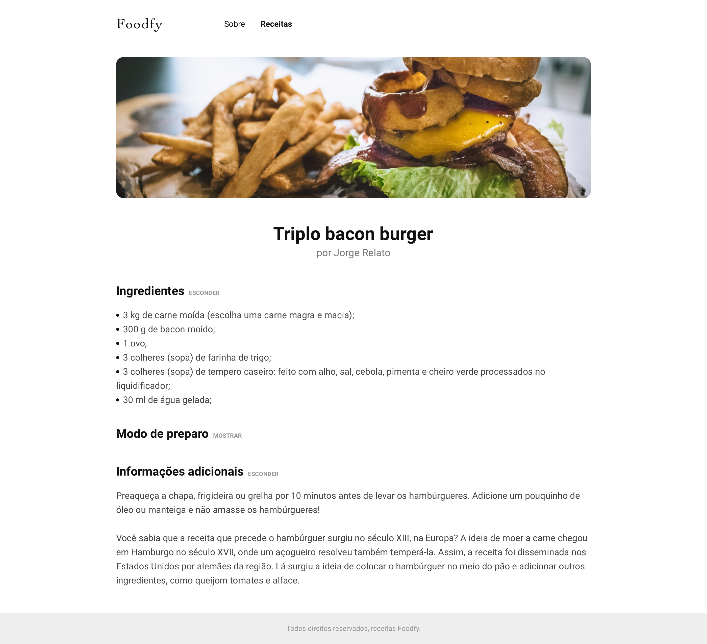
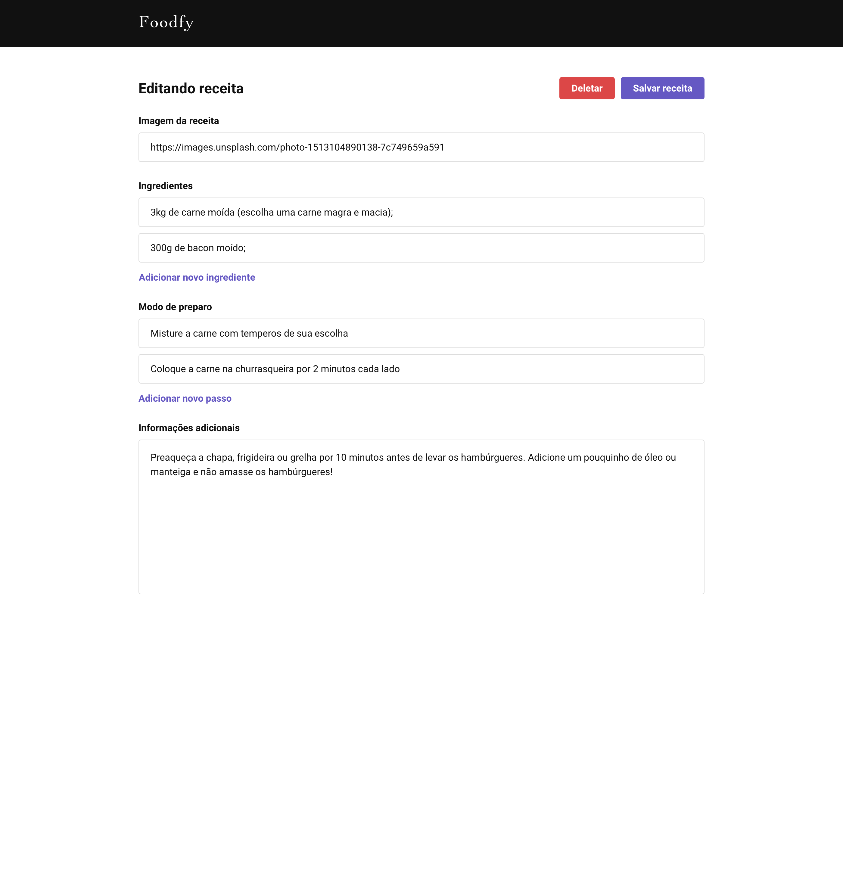
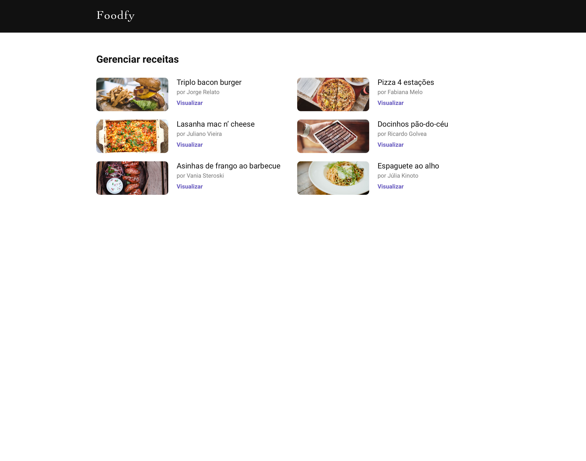
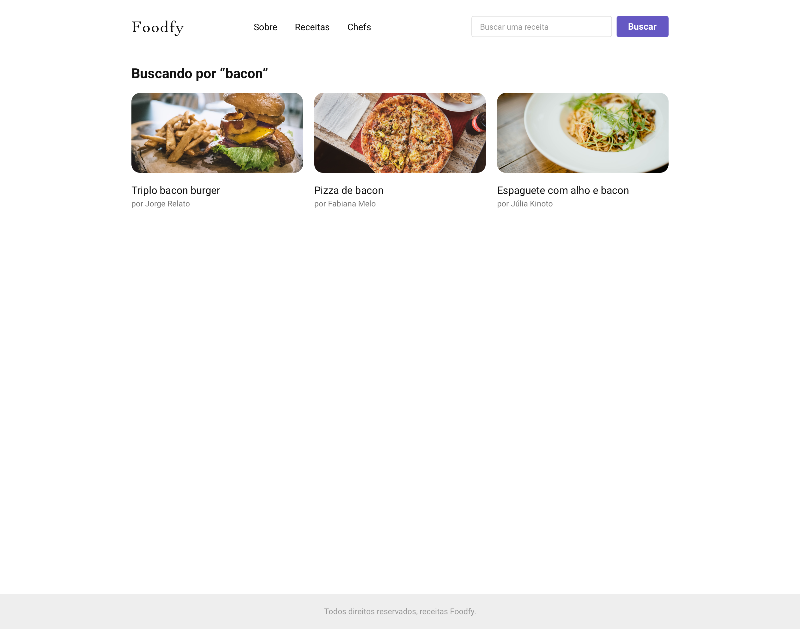
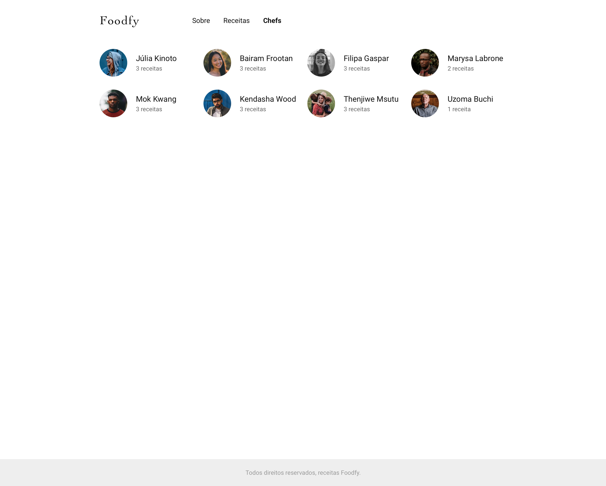
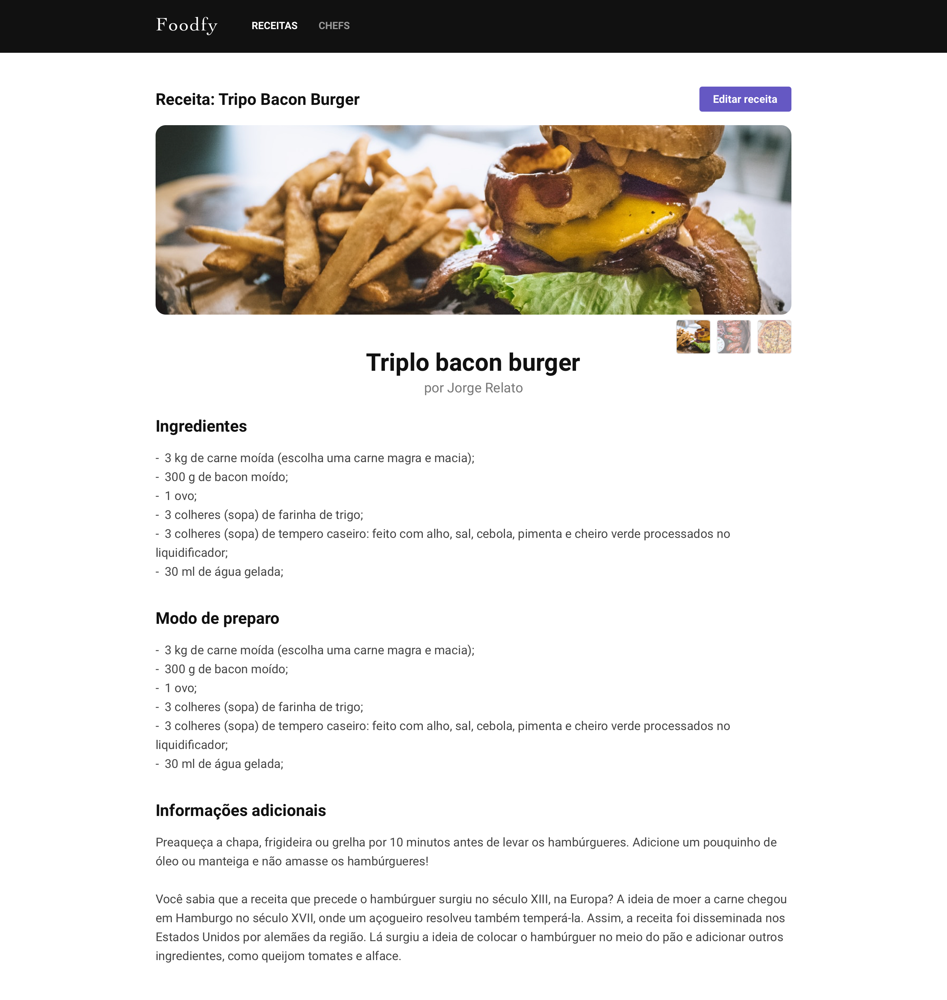

<p align="center">
  

  

  <a href="https://www.twitter.com/wellingtoncid/">
    
  </a>
  
  <a href="https://github.com/wellingtoncid/README/commits/master">
    
  </a>
    
   
   <a href="https://github.com/wellingtoncid/README-proffy/stargazers">
    
  </a>

  <a href="https://linkedin.com/in/wellingtoncid">
    
  </a>    
 
</p>
<h1 align="center">
    
</h1>

<h4 align="center"> 
	🚧  Finished: Final challenge LauchBase Bootcamp 🚀 🚧
</h4>

<p align="center">
 <a href="#-about">About</a> •
 <a href="#-features">Features</a> •
 <a href="#-layout">Layout</a> • 
 <a href="#-how-it-works">How it works</a> • 
 <a href="#-tech-stack">Tech Stack</a> • 
 <a href="#-contributors">Contributors</a> • 
 <a href="#-author">Author</a> • 
 <a href="#user-content--license">License</a> • 
 <a href="#versao-em-portugues">Versão em Português</a>
</p>


## 💻 About

Foodfy - is a system for managing recipes, a way to connect chefs, recipes and lovers of a good meal made in an artenasal way, with their own hands-on experience.

Project developed during Bootcamp **LaunchBase** by [Rocketseat](https://blog.rocketseat.com.br/).
LaunchBase is an online bootcamp training that lasts 8 weeks with lots of practical content, challenges and hacks to take web development to the next level.

---

## ⚙️ Features

- [x] The administrator has full access to the platform, where he can:
  - [x] create, view, edit or delete chefs, users and recipes
  - [x] register new administrators
  - [x] when registering chefs and users, add:
    - Name or email of the chef or user
    - Avatar
    - Send encrypted password via registered email

- [x] Registered users have exclusive access to the application, where they can:
  - [x] browse the site to view the recipes and registered chefs
  - [x] register recipes and assign them to their respective chefs
  - [x] register a new password, in case you have forgotten
  - [x] when registering a new recipe, the user can
    - Add up to 5 images of the recipe in png, jpg, or jpeg format
    - Choosing a chef
    - Title of the recipe
    - Full description of the ingredients
    - Complete step-by-step description of the method of preparation
    - Description of additional revenue information

- [x] Any culinary user can:
  - [x] browse the site to view the registered recipes
  - [x] view the details of the recipes and their respective chefs
  - [x] hide or show details, such as ingredients, preparation method and additional information

---

## 🎨 Layout

### Web

<p align="center" style="display: flex; align-items: flex-start; justify-content: center;">

  

  

  

  

  

  

  

  
</p>

---

## 🚀 How it works

### Prerequisites

Before you begin, you will need to have the following tools installed on your machine:
[Git](https://git-scm.com), [Node.js](https://nodejs.org/en/), [PostgreSQL](https://www.postgresql.org/download/), [Postbird](https://www.electronjs.org/apps/postbird). 
In addition, it is good to have an editor to work with the code like [VSCode](https://code.visualstudio.com/).


#### 🧭 Running the application

```bash

# Clone this repository
$ git clone https://github.com/wellingtoncid/foodfy.git

# Access the project folder cmd/terminal
$ cd foodfy

# install the dependencies
$ npm install

#Set up the database
psql -U <username> -c "CREATE DATABASE foodfydb"
psql -U <username> -d foodfy -f foodfydb.sql

You can manually import the foodfy.sql to Postbird, remember to create a new database with the name foodfydb.
- Important!
You have to alter the db.js, located in src/config to match your PostgreSQL settings.
You also have to alter the mailer.js, located in src/lib to match your Mailtrap settings.

# Populate it with Faker.js
node seed.js

-Attention:
The Faker user password is "1234", you need to check each users settings on Postbird.

# Run the application in development mode
$ npm run start

# The application will open on the port: 3000 - go to http://localhost:3000

```

---

## 🛠 Tech Stack

The following tools were used in the construction of the project:

#### [](https://github.com/wellingtoncid/foodfy#server-nodejs)**Website/Server** ([Javascript](https://javascript.com)) ([NodeJS](https://nodejs.org/en/))
-   **[Express](https://expressjs.com/)**
-   **[PostgreSQL](https://postgresql.org)**
-   **[Multer](https://github.com/expressjs/multer)**
-   **[NodeMailer](https://nodemailer.com)**   
-   **[Faker](https://github.com/marak/Faker.js/)**

> See file [package.json](https://github.com/wellingtoncid/foodfy/blob/master/package.json)

#### [](https://github.com/wellingtoncid/launchbase#utilit%C3%A1rios)**Utilities**

-   Editor:  **[Visual Studio Code](https://code.visualstudio.com/)**
-   Animation:  **[Lottie](https://github.com/airbnb/lottie-web)**
-   Fonts:  **[Roboto](https://fonts.google.com/specimen/Roboto)**, **[Material icons](https://material.io)** 


---

## 👨‍💻 Contributors

<table>
  <tr>
    <td align="center"><a href="https://linkedin.com/in/wellingtoncid"><br /><sub><b>Wellington Cid</b></sub></a><br /><a href="https://linkedin.com/in/wellingtoncid" title="Rocketseat">👨‍🚀</a></td>
  </tr>
</table>

## 💪 How to contribute

1. **Fork** the project.
2. Create a new branch with your changes: `git checkout -b my-feature`
3. Save your changes and create a commit message telling you what you did: `git commit -m "feature: My new feature"`
4. Submit your changes: `git push origin my-feature`
> If you have any questions check this [guid on how to contribute in GitHub](./CONTRIBUTING.md)

---

## 🦸 Author

<a href="https://linkedin.com/in/wellingtoncid/">
 
 <br />
 <sub><b>Wellington Cid</b></sub></a> <a href="https://linkedin.com/in/wellingtoncid/" title="WellingtonCid">🚀</a>
 <br />

[](https://twitter.com/wellingtoncid) [](https://www.linkedin.com/in/wellingtoncid/) 
[](mailto:cid.wellington@gmail.com)

---

## 📝 License

This project is under the license [MIT](./LICENSE).

Made with ❤️ by Wellington Cid 👋🏽 [Get in touch!](https://www.linkedin.com/in/wellingtoncid/)

---

## Versão em Português

Clique aqui para ver a versão em [Português 🇧🇷](./README-ptbr.md)
